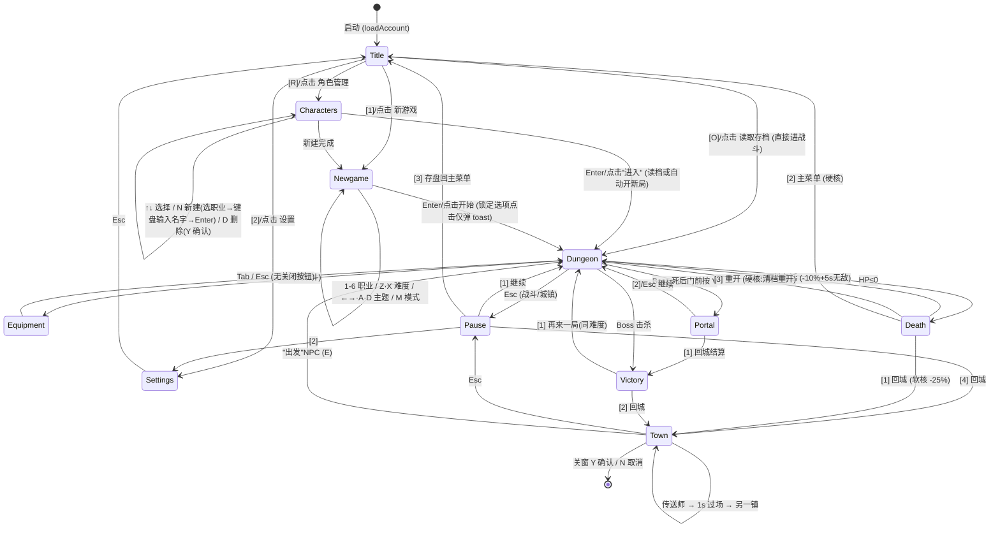

# Voidbound 界面流程审查报告

> 日期:2026-08-12
> 范围:`main.ts` (2962 行) · `render/hud.ts` · `input/keyboard.ts` · `input/mouse.ts` · `game/town.ts` · `game/newgame.ts` · `game/skill.ts`
> 目标:梳理界面流程与交互图,审查快捷键与鼠标操作缺口,优化首次进入与后续进入流程

---

## 1. 界面流程状态机

## 2. 每屏交互矩阵

| 屏幕 | 组件 | 键盘 | 鼠标 | 缺口 |
|---|---|---|---|---|
| Title | 新游戏/设置/读档/角色管理 | 1/2/O/R | ✅ 4 按钮可点 | 无"继续游戏"大按钮;读档键 `O` 无语义 |
| Newgame | 职业×6/难度×5/主题/模式/开始 | 1-6·Z·X·←→·M·Enter | ✅ 均已命中测试 | 模式维度靠 `M`/`←` 顺带切换,不可发现;锁定项点击仅弹 toast 无置灰 |
| Characters | 列表/进入/新建/删除 | ↑↓·Enter·N·D·Y | ✅ 列表/按钮可点 | 命名输入无鼠标确认/取消,只能 Enter/Esc |
| Dungeon | 技能栏 Q/F/E/R、药水、翻滚 | WASD·Space·Q/F/E/R·LMB/RMB·1/2·Ctrl+1..6·Tab·Esc·V·P·O·L | ❌ 仅 LMB/RMB 攻击 | 技能栏/药水/翻滚/暂停/装备全部不可点击;MMB 闲置 |
| Equipment | 6 槽位/背包格/装备/卸下 | 方向键·PgUp/Dn·滚轮·A·Enter·U·D·Tab·Esc | ✅ 格/按钮可点 | 无关闭按钮;D=卸下与角色管理 D=删除语义冲突 |
| Town | 9 个 NPC 圆点+`E` 提示 | E 交互,面板 1-9·S·B·Enter | ⚠️ 仅面板行可点 | NPC 不可点击,必须走近+E;训练师升级无鼠标按钮 |
| Pause | 继续/设置/主菜单/回城 | 1-4·Esc·P | ✅ 4 段可点 | — |
| Death | 三选/二选 | 1-3 | ✅ 可点 | — |
| Victory | 再来一局/回城 | 1-2 | ✅ 可点 | — |
| Portal | [1]回城结算 [2]继续 | 1·2·Esc | ❌ `handleUiClick` 无此 case,纯键盘 | 需补 |
| Settings | 音量滑条/全屏/难度 | + -·F·N·Esc | ❌ 滑条画了但不可拖动,按钮不可点 | 需补 |
| Rune 三选一 | 3 个符文盒 | 1/2/3·0·Esc | ✅ 可点 | 提示文案没写"可点击" |
| 关窗确认 | Y/N | Y·N·Esc | ❌ 纯键盘 | 需补 |

## 3. 快捷键清单(~48 个)

**战斗高频群(合理)**:`WASD` 移动 · `Space` 翻滚 · `Q/F/E/R` 技能 · `LMB/RMB` 攻击 · `1/2` 药水 · `Tab` 装备 · `Esc` 暂停

| 屏幕 | 键位 |
|---|---|
| Title | 1 新游戏 · 2 设置 · O 读档 · R 角色管理 · Esc 关设置 · Y 硬核确认 |
| Characters | ↑/↓ 选择 · Enter 进入 · N 新建 · D 删除 · Y 确认 · 命名:字符输入/Backspace/Enter/Esc |
| Newgame | 1-6 职业 · Z/X 难度 · ←→/A/D 主题 · M 模式 · Enter 开始 · Esc 返回 |
| Dungeon | WASD · Space 翻滚 · Q/F/E/R 技能 · LMB/RMB · 1/2 药水 · Ctrl+1..6 技能点 · Tab 装备 · Esc 暂停 · V 传送门 · P 存档 · O 读档 · L 日志 |
| Equipment | 方向键 · PgUp/PgDn/滚轮 · A/Enter 装备 · U/D 卸下 · Tab/Esc 关闭 |
| Pause | 1 继续 · 2 设置 · 3 主菜单 · 4 回城 · Esc 继续/关设置 · P 存档 |
| Death | 1 回城 · 2 原地复活 · 3 重开 (硬核:1 清档重开 · 2 主菜单) |
| Victory | 1 再来一局 · 2 回城 |
| Portal | 1 回城结算 · 2/Esc 继续 |
| Town | E 交互 · 面板 1-9 选择 · 6 卖 · 7/8 药水 · 9 灵铁 · S 存入 · B 返回 · Enter/空格 升级(训练师) · ↑↓ 选被动 · Esc 关 |
| Rune | 1/2/3 选择 · 0/Esc 拒绝 |
| 关窗 | Y 保存退出 · N/Esc 取消 |
| Settings | +/- 音量 · F 全屏 · N 难度循环 · Y/Esc 硬核确认 |

### 问题清单

| 级别 | 问题 | 证据 |
|---|---|---|
| P0 | `F` 键是 **W 槽的施放键**(`skillByKey={q:'Q',f:'W',e:'E',r:'R'}`),HUD 显示 `Q/F/E/R` 但内部槽为 `LMB/RMB/Q/W/E/R`——心智错位,新玩家不知 F 对应哪个槽 | `skill.ts:18-20`、`main.ts:770` |
| P0 | 功能键混入玩家键:`O` 读档、`P` 存档、`L` 日志、`V` 传送门、`Ctrl+1..6` 技能点——5 个非玩家操作占用主键盘区 | `main.ts:764-797` |
| P1 | 语义冲突:`D`=删除角色(characters)/`D`=卸下装备(equipment);`Z/X` 难度循环与 `A/D` 主题方向不一致;`←` 顺带切模式 | `main.ts:377-591`、`newgame.ts:31-44` |
| P1 | 城镇 9 面板全部数字键 1-9 + `S` 存 `B` 返——纯数字键盘 UI,无按钮视觉 | `main.ts:1415-1430` |
| P2 | `Esc` 语义已统一(取消/关闭/继续),无问题 ✅ | 全局 |
| P2 | 提示双轨:标题底行与暂停设置文案各写一份(标题 `Q/F/E/R 技能`,设置内 `Q 火球 F 连发 E 回血 R 大招`);LMB/RMB 槽在 HUD 技能栏上不可见 | `main.ts:1738`、`main.ts:2330` |

## 4. UI 设计问题

1. **全文本按钮,无视觉状态**:标题 `[1] 新游戏` 是纯文字,无 hover/按下态、无光标反馈——鼠标玩家不知道哪里可点(点击区靠 `inRect`,视觉上不可见)
2. **城镇面板行命中区 24px**、无焦点环
3. **首局零引导**:无 PLAYER_UX.md 建议的 3 气泡(WASD→LMB→Q),首次进 dungeon 直接开打
4. 新局配置 4 维(职业/难度/主题/模式),模式无预览文案
5. 设置滑条绘制完成度最高但功能缺失(画了滑条,拖不动)

## 5. 首次进入流程优化(目标:≤3 次点击进战斗)

**现状**:Title(点新游戏)→ Newgame(选 4 维)→ Enter → 战斗 = 2 步,但选择压力大;玩家不知道 `M` 模式;锁定难度靠报错提示。

**方案**:
1. **主菜单双态**:无存档 → `[新游戏]` 放大高亮置首,`[继续]` 置灰禁用;有存档 → `[继续游戏]` 置首并显示摘要 `野蛮人 Lv12 · 森林·普通 · 上次:地牢`
2. **Newgame 折叠**:首屏默认 = 职业(6 图标卡)+ 难度(已解锁置亮/锁定置灰)+ 主题;**模式移入高级选项**(默认 linear),`M` 保留但不再首屏提示——首次玩家维度 4→3
3. **首局引导**:进 dungeon 后 3 个气泡(LMB 攻击 → Q 技能 → Space 翻滚),30 秒内按键自动跳过;HUD 底部常驻淡显按键条
4. 默认值直达:首次玩家直接 `Enter` 开打(普通/森林/野蛮人),命名自动 `char_0`,不挡路

## 6. 后续每次进入优化

**现状**:进游戏 = 进 dungeon(`loadGame` 一律 `setScreen('dungeon')`,`main.ts:363-366`),即使上次死于城镇/想整理装备也被直接丢进战斗;主菜单"继续"藏在 `[O] 读取存档`。

**方案**:
1. **继续按钮** = 最近角色一键直达,按存档位置分派:上次 town → 进城镇;dungeon → 进地牢;按钮上显示进度摘要
2. 角色管理顶部加**最近 3 角色快捷横排**(PLAYER_UX.md P1-6 原案),单击即进
3. 死亡/通关已有三选/再来一局 ✅,保持;Portal 补鼠标按钮后,整条"回城→整理→出发"链路鼠标可通
4. 关窗确认补 Y/N 按钮,避免误关丢进度

## 7. 鼠标化实施清单(按依赖排序)

| Step | 内容 | 触及文件 |
|---|---|---|
| 1 | 统一 clickTarget 抽象(按钮矩形+hover 态+hover 光标);HUD 技能栏 4 槽 + 药水 1/2 + 翻滚变可点击按钮(~40px 目标) | main.ts、hud.ts、draw.ts |
| 2 | Portal 面板补鼠标;Settings 滑条拖动(+/-/F/N 按钮化);Equipment 加关闭/翻页按钮;关窗确认 Y/N 按钮;命名确认/取消按钮 | main.ts |
| 3 | 城镇 NPC 点击 → 自动走向 + 到达自动交互(D2 风格);面板行 hover 高亮 + 训练师升级按钮 | main.ts、town.ts、draw.ts |
| 4 | 主菜单"继续"按钮 + 进度摘要 + 存档位置分派;Newgame 模式折叠;首局 3 气泡引导 | main.ts、newgame.ts、player.ts |
| 5 | 快捷键收敛:`V` 退役并入 `E`(NPC/传送门统一交互);`P/O/L/Ctrl+技能点` 移出主提示;`D`=卸下改为点击卸下,消除双义 | main.ts、hud.ts、skill.ts |

**保留核心 12 键**:`WASD/Space/Q·F·E·R/LMB·RMB/1·2/Esc/Tab/Enter`,其余全部按钮化降级为提示内小字。

---

## 8. 美术与特效缺口审查 (2026-08-12, 代码核查)

### 8.1 贴图缺口

| 项目 | 现状 | 证据 |
|---|---|---|
| 技能栏图标 | ❌ 4 槽为手柄键帽 buttonA/B/X/Y, 与技能内容无关 | hud.ts `SKILL_ICONS` |
| 药水图标 | ❌ HUD/商店全纯文字 "药水 1:×N" | hud.ts、town.ts |
| 材料/道具图标 | ❌ 灵铁/奥术核心/虚空碎片无图标 | town.ts |
| 图标库 | icons.json 105 个 = 按键/箭头/齿轮等通用, 无奇幻图标/药水 | icons.json |
| 素材包 | game-icons.zip / ui-pack.zip 均 kenney 通用包, 无奇幻图标 | zip 清单 |

→ 技能/药水/材料图标需新美术 (可走 assets/ai-gen 管线 → atlas 打包)。

### 8.2 特效现状 (已实现: 通用粒子 + additive 合批)

- 火球/暗影箭/圣光弹/毒镖/连发 = `magic_01` 单粒子, 仅颜色区分 (main.ts:2391)
- 近战挥击 = `slash_01` (melee/thrust/bash 共用)
- 敌弹 = `magic_05` 红球; Boss 螺旋弹幕同款
- 死亡粒子 `slash_02`、掉落/传送门 `spark_03`、受击 tint、伤害数字、Boss 横幅、激光预警条、机制条、光环点

### 8.3 特效缺失 (技能逻辑全有, 视觉为零)

| 技能/机制 | 逻辑 | 视觉 |
|---|---|---|
| 旋风斩/冰霜新星 | castAoe 纯伤害 | ❌ 无扩散环/旋风 |
| 闪电链 | castChain 3 跳 | ❌ 无闪电连线 |
| 终极 | 范围爆炸 | ❌ 无爆炸波 |
| 回血 heal | 纯数值 | ❌ 无治愈光 |
| 护盾/毒池/自爆 | 机制状态机 | ⚠️ 仅机制条颜色 |
| 新星/狂暴/召唤精英 | Boss 技能 | ❌ 无爆发环/红光/传送阵 |

### 8.4 结论与优先级

- **特效缺接入不缺素材**: particles.json 96 个粒子, flame*/fire*/smoke*/muzzle*/light*/scorch* 约 80 个 100% 闲置
- 推荐顺序: ① 通用 VFX 发射器 (SkillFx 表: 施放点/半径/粒子/颜色/生长曲线, 半天量) ② 药水+材料小图集 ③ 12 技能专属图标 (可先粒子缩略图过渡) ④ 怪物机制视觉 (护盾弧/毒池/新星环)

---

## 9. 实施状态追踪

| 版本 | 内容 | 状态 |
|---|---|---|
| v1 (2026-08-12) | 新建角色面板一体化 (立绘/信息/难度默认/命名按钮化) | ✅ |
| v1 | 新局选择屏重构 (职业/难度/主题卡/模式卡/hover/光标) | ✅ |
| v1 | 城镇出发 = 新开一局 (远征选择屏, 不再续接旧局) | ✅ |
| v1 | portal 鼠标按钮 + 标题 hover + mage 立绘修复 (CLASS_SPRITES) | ✅ |
| v2 | HUD 战斗按钮鼠标化 (技能栏 4 槽 + 药水 1/2 + 翻滚, hover 高亮 + pointer) | ✅ |
| v3 | 设置滑条拖动 / 装备关闭·翻页按钮 / 关窗 Y·N 按钮 / 城镇 NPC 点击走向自动交互 / 面板行 hover | ✅ |
| v4 | 主菜单"继续游戏"大按钮+进度摘要 / 读档按场景分派 (存档 v11 scene 字段) / 最近 3 角色横排 / 首局 3 气泡引导 | ✅ |
| v5 | 快捷键收敛: V 并入 E 统一交互 / 提示文案单点生成 / D=卸下移除 / 调试键移出主提示 / 操作自定义 (键位模块 localStorage) | ✅ |
| C | 速通计时器 HUD / 探索度统计+小地图块渲染 / 收集总览面板 (套装/技能/符文/通关) / 符文变异预览 tooltip / 死亡撤销 5s 窗口 / HUD 键标动态化 + W 槽 CD 查询修复 | ✅ |
| B | 技能图标 + 药水图标 (另一 session) | ✅ 进行中 → VFX/材料图标/怪物机制视觉见 §8 |
